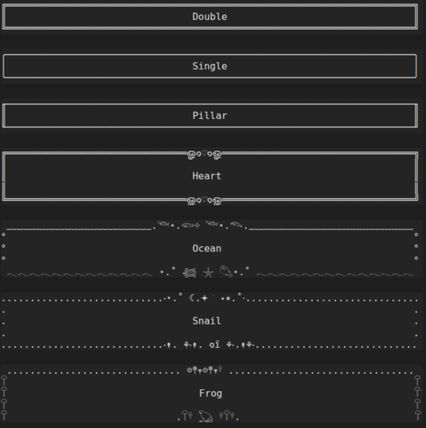
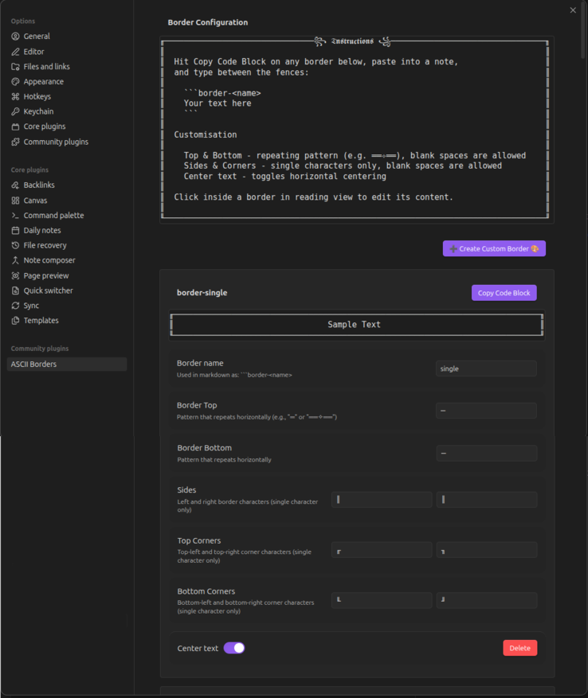

# ASCII Borders for Obsidian

![When writing notes on paper as a student I would draw borders around sections of text in my notes. Perhaps you did as well!Sometimes different borders were used to convey semantic meaning, such as double lines around important information, and squiggles around side thoughts. If class was particularly boring, my borders might start incorporating doodles and elaborate designs. I still take a lot of notes. Well organized notes with a lot of important information. Ugly plain notes. This plugin is the cure for bland notes that spark no joy.](assets/description.png)

## Features

- ASCII art borders around text using code blocks
- 6 pre-built border styles: double, single, pillar, heart, ocean, snail
- Customizable borders via settings UI
- Add, rename, and delete custom borders
- Live preview of borders in settings
- Text centering option
- Auto-resize borders to container width
- Click anywhere within border while in editing view to edit contents
- Support for wide characters and complex Unicode (including Egyptian hieroglyphs)
- Character width caching for performance
- Mobile device support

## Usage

Create a code block with `border-` followed by the style name.
Default syles include border-double, border-single, border-pillar, border-heart, border-ocean, border-snail.

Create a code block with `border-` followed by the style name:

````markdown
```border-heart
Your text here
```
````

Click outside of the code block to see the border.
Click the code block to go back to content editing mode.

## Settings

Access plugin settings via **Settings → Community Plugins → ASCII Borders**.

## Adding, Deleting, and Customising Borders

### Creating Custom Borders

1. Open plugin settings
2. Click **➕ Create Custom Border 🎨**
3. A new border named `custom` is added at the top of the list
4. Rename and customize it as desired

### Customising Border Characters

Each border has 8 customizable components:

**Top & Bottom** - Repeating horizontal patterns

- Accepts any length string (e.g., `═`, `══✧══`, `~*~`)
- Pattern repeats to fill width
- Blank spaces allowed
- Supports Unicode including emojis and hieroglyphs

**Sides** - Left and right edges

- Single character only (e.g., `║`, `|`, `│`, `*`)
- Blank spaces allowed
- Supports Unicode including emojis and hieroglyphs

**Corners** - Four corner characters

- Top-left, top-right, bottom-left, bottom-right
- Single character only
- Blank spaces allowed

**Center Text** - Toggle to horizontally center content

### Renaming Borders

1. Edit the **Border name** field
2. Click outside the field to apply
3. Update any code block usage to `border-<new-name>`
4. Names automatically normalized to lowercase with hyphens

### Deleting Borders

1. Scroll to the border you want to remove
2. Click the red **Delete** button
3. Border removed from settings
4. Reload Obsidian for changes to take effect

### Using Borders in Notes

1. Click **Copy Code Block** next to any border
2. Paste into your note
3. Type content between the fences
4. Click outside to render

## Installation

### From Obsidian Community Plugins - Not yet available

### Manual Installation

1. Download `main.js`, `manifest.json`, and `styles.css` from the latest release
2. Create a folder named `ascii_borders` in your vault's `.obsidian/plugins/ directory`
3. Copy the downloaded files into the folder
4. Reload Obsidian and enable the plugin under **Settings → Community Plugins**

### Development Installation

1. Clone this repo into your vault's `.obsidian/plugins/ directory`
2. Run `npm install` to install dependencies
3. Run `npm run dev` for development with auto-rebuild, or `npm run build` for a production build
4. Reload Obsidian and enable the plugin under **Settings → Community Plugins**

| Note: Obsidian must be reloaded after each rebuild to reflect changes. I recommend using a separate test vault to avoid any risk to your main vault during development.

### Troubleshooting

#### Border not rendering correctly

Check for unintentional whitespace in your border definition.

#### Deleted or renamed borders still appearing

These will remain active until Obsidian is reloaded.

#### General loading/rendering issues

Try clicking inside of the border, and then outside of the border.
If that does not work, try reloading Obsidian: press **Ctrl/Cmd+P**, type **Reload**, and select **Reload app without saving**.

#### Border sides not aligning

Character width measurement is imprecise by nature. Add or remove characters manually until the alignment looks right.

#### Reporting Issues

If you run into a bug, please open an issue. Before doing so, check the Obsidian console for any relevant error messages — open it via **Settings** → **About** → **Open DevTools** (or **Ctrl/Cmd+Shift+I**). Include anything useful in the issue report.
I'll address issues as quickly as I can. PRs are also welcome.

## Images

### Default Borders:



### Settings Page:


